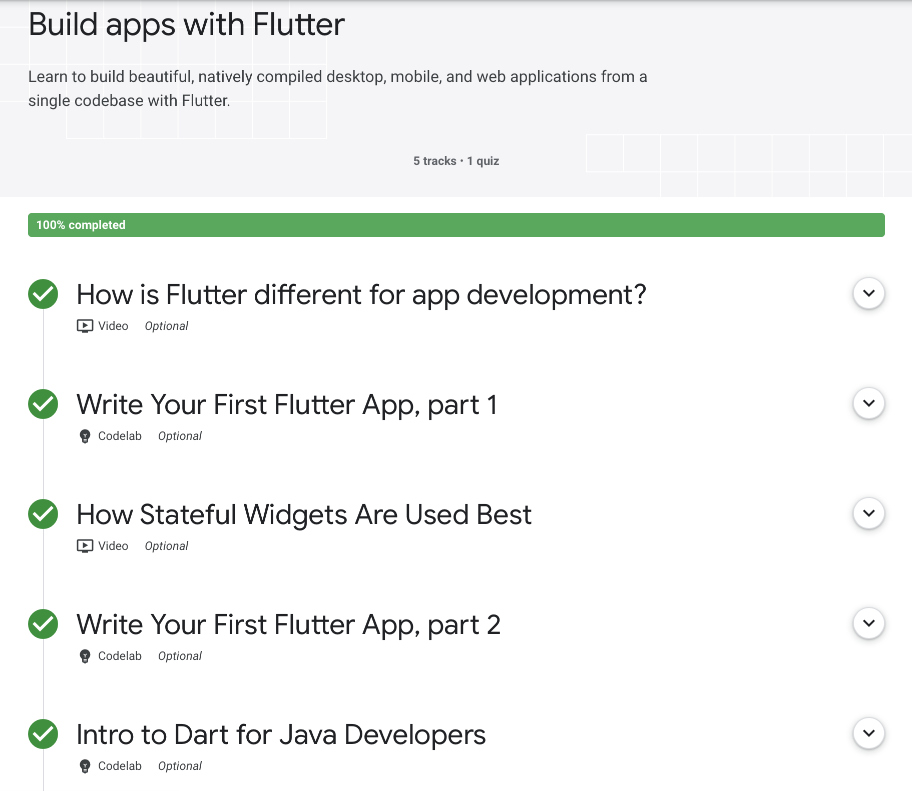
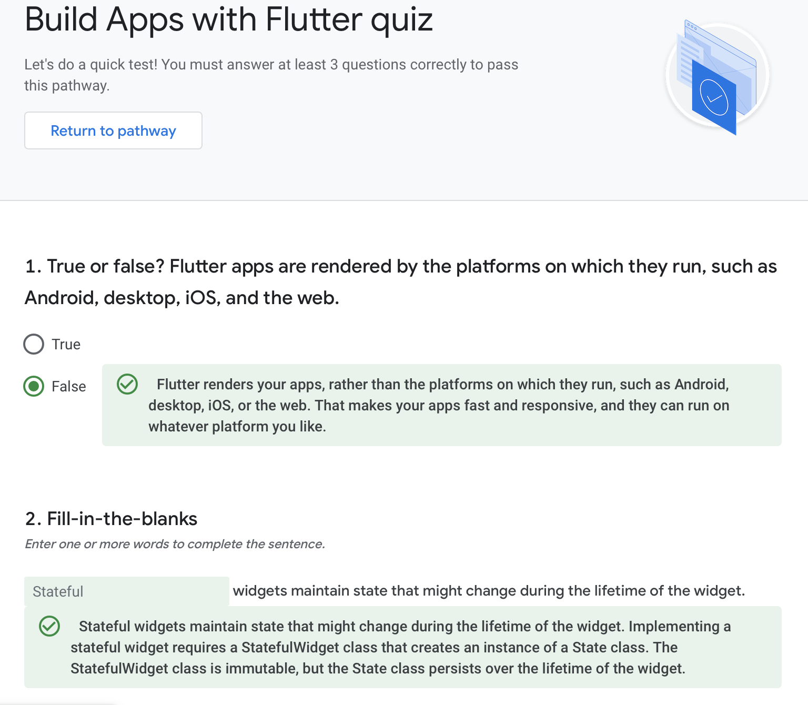
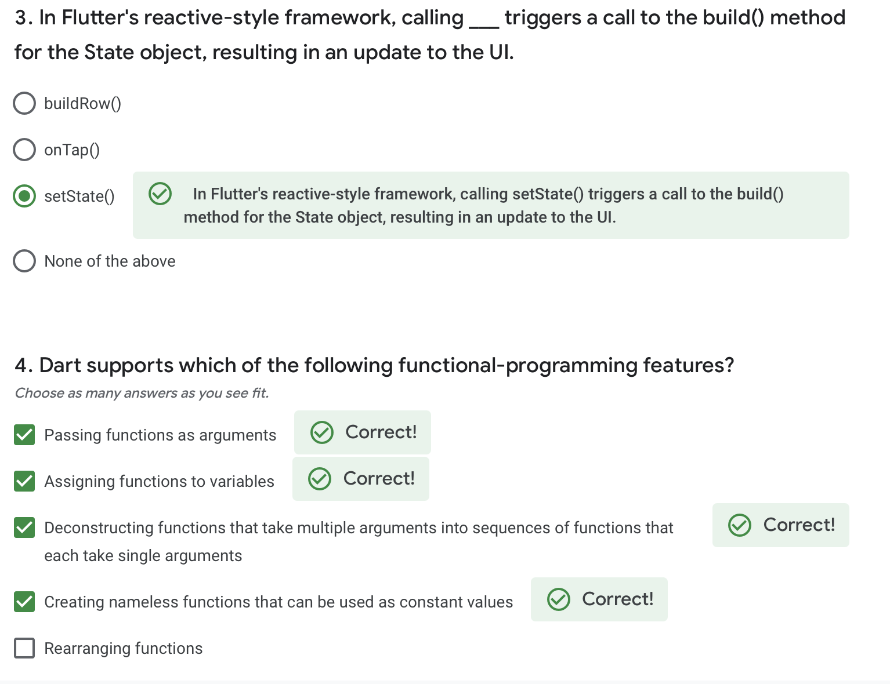
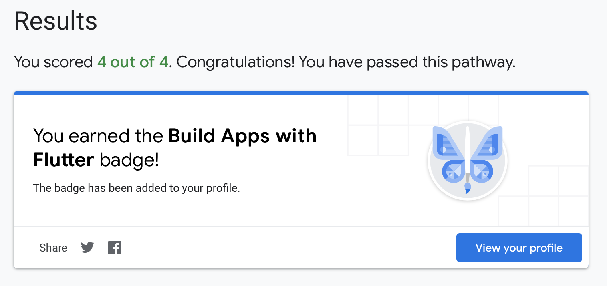

# Build apps with Flutter

Learn to build beautiful, natively compiled desktop, mobile, and web applications from a single codebase with Flutter.

Before taking the quiz, it is advised you take the tutorials, which can found here :

[Build apps with Flutter](https://developers.google.com/learn/pathways/intro-to-flutter?hl=en)

Below is the content breakdown

**Build Apps With Flutter Content**

## Build Apps with Flutter quiz

**Flutter Quiz 1-2**

**Flutter Quiz 3-4**

After taking the quiz, you should have a badge like this :
**Build apps with Flutter Badge**

After following along with the tutorials , you will have the same app as mine. 
Happy Coding!!!